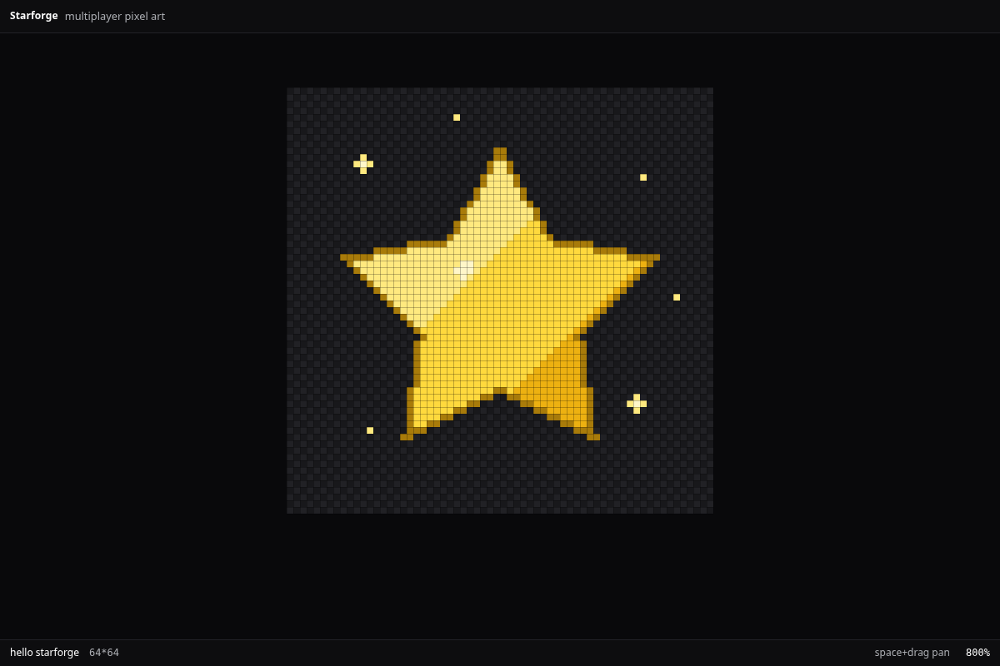

# Starforge

A multiplayer pixel art & animation studio that runs entirely in the browser.



## Features (so far)

- Crisp pixel rendering at every zoom level
- DPR-aware so it stays sharp on retina displays and through browser zoom

## Run locally

```bash
npm install
npm run dev
npm test
npm run lint
```

Node 20.19+

## Architecture

Monorepo with npm workspaces:
`core/` Holds the document model and ops with zero dependencies.
`client/` The Vite + Preact editor.

The full design document lives at
[docs/DESIGN.md](docs/DESIGN.md).

## License & credits

[MIT](LICENSE).
