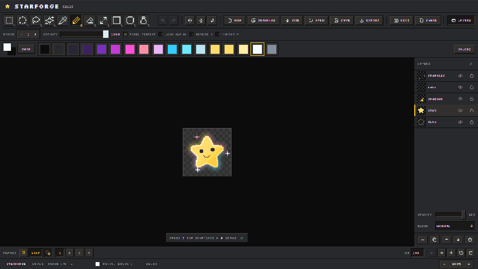

# Starforge

[Open the editor](https://starforge.lacorte.city). A Pixel Art & animation studio in your browser.



Draw with the classic toolkit: pencil, shapes, bucket, four kinds of selection, on layers with blend modes, then bring it to life on a frame timeline.
Colors come from an editable palette and an HSV Color Studio. Documents autosave, live in a local library, and travel as `.starforge` projects or as Portable PNGs.

Shortcuts follow Aseprite. Press `?` in the editor.

## Run locally

Requires Node 20.19+.

```bash
npm install
npm run dev        # editor at localhost:5173
npm run build      # production bundle
npm test           # unit and property tests
npm run test:e2e   # playwright: draw, reload, export
npm run bench      # ink kernels on node, compositor in the browser
npm run lint       # prettier + eslint + tsc
```

## Architecture

An npm workspace with two packages, split by what they are allowed to know:

| Package   | Contains                                                                                                            | Depends on |
| --------- | ------------------------------------------------------------------------------------------------------------------- | ---------- |
| `core/`   | document model, operations with inverses, ink kernels, flood fill, geometry, masks, frames, palettes, serialization | nothing    |
| `client/` | canvas engine, tools, compositor, controllers, UI, storage                                                          | `core`     |

## Roadmap

**Shipped**: canvas engine, the tool set above, layers, a frame timeline
with per-frame duration, playback and onion skin, mirror drawing,
palettes and the Color Studio, a hand-rolled GIF89a + LZW encoder with
median-cut quantization and a live export preview, spritesheets, project
files and portable PNG, documents that survive a reload.

**Next**:
- a CRDT for real-time collaboration (LWW per cell with Lamport clocks)
- WebGL filters
- a public gallery?

## License

[MIT](LICENSE)

The interface is set in [Silkscreen](https://github.com/googlefonts/silkscreen) by
Jason Kottke, used under the SIL Open Font License.

Toolbar and UI icons are from [pixelarticons](https://pixelarticons.com) by
Gerrit Halfmann, used under the MIT License.
